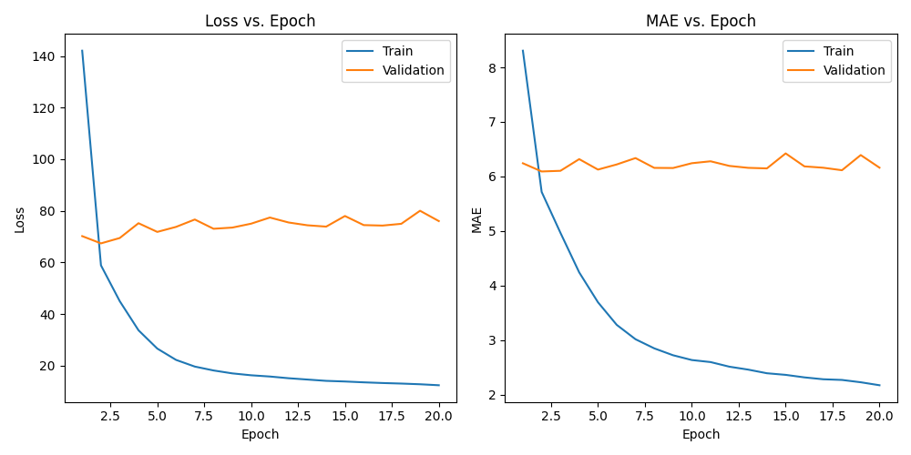
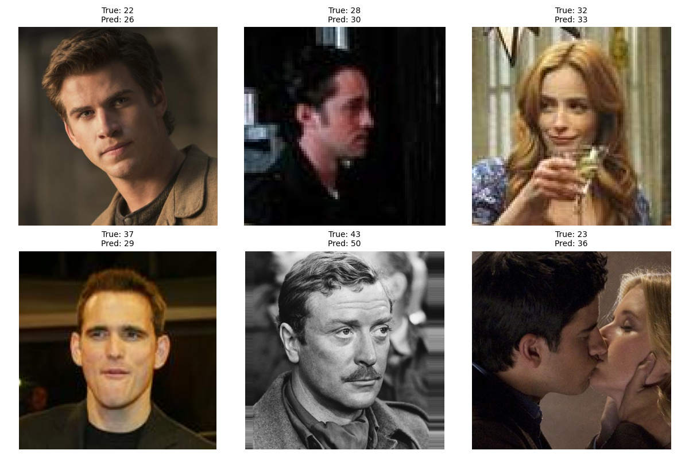

# IMDB‑WIKI Age Estimation with ResNet50
Проект представляет собой полную реализацию пайплайна оценки возраста по лицу 
на датасете IMDB‑WIKI с использованием сверточной нейросети ResNet50 в постановке регрессии.


## Цель проекта
* **Обучить модель ResNet50** для предсказания возраста 
по фотографии лица человека на датасете IMDB‑WIKI; 
* **Функция потерь:** MSE;
* **Метрика качества:** MAE;
* **Ожидаемый результат:** 4-6 лет (типичный диапазон для IMDB‑WIKI 
при использовании предобученных моделей).

## Результаты

Модель оценивания возраста по лицу на датасете IMDB‑WIKI в постановке регрессии.

| Сплит | MAE (лет) |
|-------|-----------|
| train | 5.717     |
| val   | 6.092     |
| test  | **5.609** |

*Модель выбиралась по лучшему **val MAE**, статистический разброс на **test** в норме*

- Модель: ResNet50 с предобученными на ImageNet весами и небольшой регрессионной «головой».
- Диапазон возрастов в финальной оценке: примерно 10–75 лет (крайние значения отфильтрованы как наиболее шумные).
- Обучение: 20 эпох, оптимизатор AdamW, функция потерь MSE, основная метрика качества — MAE в годах.


## Данные
Используется общедоступный датасет [IMDB‑WIKI – 500k+ face images with age and gender labels](https://data.vision.ee.ethz.ch/cvl/rrothe/imdb-wiki/).

### Структура проекта
```
Age_Detect_ResNet/
  ├─ src/
  │   └─ age_detect_resnet/
  │       ├─ __init__.py
  │       ├─ dataset.py
  │       ├─ model.py
  │       ├─ train.py
  │       ├─ inference.py
  │       └─ preprocessing/
  │           ├─ __init__.py
  │           ├─ build_meta.py
  │           ├─ tabular.py
  ├─ data/
  ├─ .gitignore
  └─ README.md
```
### Основные компоненты:

`preprocessing/` — объединение датасетов, фильтрация по возрасту;

`dataset.py` — PyTorch‑датасет и функции для создания DataLoader’ов;

`model.py` — определение архитектуры ResNet50‑регрессора;

`train.py` — тренировочный цикл, логирование метрик, сохранение лучшей модели;

`inference.py` — код для инференса обученной модели и демонстрации результатов.

`check_your_age.py` — опробуйте модель на вашем фото :)

## ML‑пайплайн проекта
### 1. Формирование meta.csv `preprocessing/build_meta.py`

Загружаем imdb.mat и wiki.mat из исходного датасета, извлекаем поля 
(такие как: год съёмки фотографии, путь к изображению, face scores). 
Вычисляем возраст на момент съёмки (разность между датой съёмки и датой рождения) 
и фильтруем по face scores.

В исходном IMDB‑WIKI `face_score1` и `face_score2` — это оценки детектора лиц:

- `face_score1` — уверенность в первом найденном лице; при значениях `±inf` лицо фактически не найдено (bounding box покрывает почти весь кадр).
- `face_score2` — оценка для второго лица; `NaN` означает, что второго лица на изображении нет.

Фильтрация:
```
meta = meta[meta["face_score1"] != "-inf"]
meta = meta[meta["face_score2"] == "nan"]
```
На выходе получаем DataFrame с ключевыми колонками:

* **age** — возраст (целое число, годы);

* **path** — относительный путь к файлу изображения (imdb_crop/..., wiki_crop/...).


### 2. Табличный препроцессинг `preprocessing/tabular.py`

Читаем `meta.csv`, уменьшаем дисбаланс по возрастам 
ограничив возраст `filter_age_range` (диапазоном **от 10 до 75 лет**) и 
количество примеров для каждого возраста `limit_classes_to_n`
(**не больше 5000**). Делим выборку на `train/validation/test` со стратификацией по возрасту.

### 3. Dataset и DataLoader `dataset.py`

Реализуем стандартный интерфейс PyTorch Dataset: на вход получает датафрейм с колонками 
image и age, а также корневую директорию с изображениями. Для каждого индекса:

1. Строим путь к изображению: images_root / rel_path;
2. Открываем изображение через PIL и приводим к RGB;
3. Применяем последовательность трансформаций (Resize → ToTensor → Normalize);
4. Возвращаем (image_tensor, age).

Возраст конвертируется в `torch.float32`

Создаём тренировочный и валидационный `Dataset`, затем `DataLoader`
с указанным `batch size` и `num_workers`.

### 4. Архитектура модели `model.py`

Модель — **ResNet50‑регрессор**:

В качестве базы используется `torchvision.models.resnet50` с предварительно обученными 
на ImageNet весами. Финальный полносвязный слой заменён на небольшую регрессионную «голову»:

`Linear(num_features, 256) → ReLU → Linear(256, 1)`

Таким образом, модель предсказывает один скалярный возраст для каждого изображения.

### 5. Обучение `train.py`

Настраиваем **CUDA** (крайне желательно проводить обучение именно через CUDA), 
и применяем **табличный препроцессинг** `preprocessing/tabular.py`. Разбиваем данные 
на **train/validation/test** `split_df_train_val_test` и применяем функции из `dataset.py` 
для создания DataLoaders:
  - `batch_size = 128`
  - `num_workers = 4`
  - `pin_memory = True`

**Инициализируем модель:** `create_resnet50_regressor(pretrained=True)`.

**Функция потерь**: `nn.MSELoss`

**Оптимизатор**: `AdamW`
  - `lr = 5e-5`
  - `weight_decay` — значение по умолчанию.

Запускаем тренировочный цикл по эпохам, считаем средний `train loss (MSE)` и `MAE` по эпохе, 
аналогично для валидационной выборки, сохраняем лучшую модель при улучшении 
валидационного `MAE`.

**Ранняя остановка**: при стабилизации `validation loss` (малое изменение между эпохами, `< 1e-5`) 
обучение будет остановлено.

После обучения визуализируем результат:


_Обучение проводилось на **3090 Ti, Ryzen 5 3600 и 16 Gb RAM** (20 эпох обучались ~2 часа)_

И проводим оценку на тестовой выборке (загружаем `best_model.pth`): 
```
MAE on test set: 5.608715241321463
```

### 6. Инференс `inference.py`

Загружаем сохранённые веса в **ResNet50‑регрессор** и переводит модель в режим `eval()`, 
предсказываем возраст на случайных фотографиях и выводим результат:



Также организован функционал `check_your_age.py`, позволяющий проверить модель на своих 
фотографиях.

**P.S.** Результат предсказания будет лучше, если на фото будет только ваше лицо, крупно, анфас,
пришёл к этому эмпирическим путём :) 

## Запуск

### 1. **Установка зависимостей:**

```
pip install -r requirements.txt
```
### 2. **Загрузка и размещение данных для обучения:**

[Скачиваем IMDB‑WIKI](https://data.vision.ee.ethz.ch/cvl/rrothe/imdb-wiki/)  и помещаем в data/raw/ согласно описанной структуре.

### 3. **Построение meta.csv:**
```
python -m age_detect_resnet.preprocessing.build_meta
```
### 4. Обучение модели:
```
python -m age_detect_resnet.train
```
### 5. Пример инференса в Python:

```
from pathlib import Path
import torch
from age_detect_resnet.inference import load_trained_model, predict_age_for_image

device = torch.device("cuda" if torch.cuda.is_available() else "cpu")
model = load_trained_model("best_model.pth", device)

age_pred, image = predict_age_for_image(
    Path("data/raw/imdb_crop/....jpg"),
    model,
    device,
)
print(f"Predicted age: {age_pred:.1f}")
```

## Эксперименты и выводы

В процессе работы над проектом были протестированы несколько подходов и настроек модели. 
Ниже кратко описаны ключевые эксперименты и сделанные выводы.

### I. Выбор постановки задачи: регрессия vs классификация

**Что пробовали**

- Классификация по возрастным диапазонам (bins): возраст переводился в интервалы 
(`10–14`, `15–19`, ...), модель обучалась с `CrossEntropyLoss`, 
качество оценивалось по accuracy, F1 и confusion matrix.

**Наблюдения**

- Accuracy и F1 по возрастным классам хуже интерпретируются для задачи 
«на сколько лет модель ошиблась», чем MAE в годах.  
- Соседние возрастные диапазоны часто путаются между собой, 
что типично для задач оценки возраста и не всегда критично 
с точки зрения прикладной ошибки.

**Вывод**

- В качестве основного варианта выбрана **регрессионная постановка**, 
так как она даёт напрямую понятную ошибку в годах и проще интегрируется 
в дальнейший анализ качества модели.

### II. Модели и архитектуры

**Что пробовали**

- Базовые сверточные архитектуры из `torchvision` (**ResNet18, VOLO, EfficientNet**) 
с предобученными на ImageNet весами (точные значения MAE не логировались).
- Различные варианты «головы» над ResNet50: один линейный слой, 
а также небольшая двухслойная MLP‑голова (`Linear → ReLU → Linear`).

**Наблюдения**

- Использование предобученных весов заметно ускоряет сходимость и 
улучшает качество по сравнению с обучением модели «с нуля», 
что согласуется с результатами в литературе по age estimation. 
- Добавление небольшой регрессионной головы над **ResNet50** даёт более стабильные результаты, 
чем один линейный слой напрямую от `fc`.

**Вывод**

- В качестве основной модели выбран 
**ResNet50 с предобученными весами и небольшой регрессионной головой**, 
которая предсказывает один скалярный возраст.

### III. Аугментация и балансировка данных

**Что пробовали**

- Базовые онлайновые аугментации (масштабирование, нормализация), 
совместимые с предобученными ImageNet‑моделями. 
- Идея оффлайн‑аугментации: генерация дополнительных изображений для 
редко представленных возрастов с сохранением аугментированных файлов 
на диск.

**Наблюдения**

- Распределение возрастов в IMDB‑WIKI существенно несбалансировано: 
некоторые возрастные группы представлены значительно чаще других. 
- Ограничение числа примеров на каждый возраст (`limit_classes_to_n`) 
помогает уменьшить перекос датасета без усложнения пайплайна аугментации.

**Вывод**

- В финальной версии используются **простые, но воспроизводимые меры балансировки** 
(ограничение числа примеров на возраст), а оффлайн‑аугментация рассматривается 
как возможное развитие проекта, но не входит в основной пайплайн.

### IV. Метрики и оценка качества

**Что пробовали**

- В качестве функции потерь — **MSE** (среднеквадратичная ошибка).  
- В качестве основной метрики — **MAE** (средняя абсолютная ошибка в годах). 
- Для классификации по бинам дополнительно считались **accuracy**, 
**F1‑мера** и строилась **confusion matrix** по возрастным диапазонам.

**Наблюдения**

- **MSE** удобен в качестве loss‑функции, но в отчётах и при интерпретации результатов 
более информативным оказался именно **MAE**: он напрямую показывает среднюю ошибку в годах.
- Для сравнения разных настроек модели оказалось достаточно отслеживать валидационный **MAE** 
и динамику **train/val‑MAE** по эпохам.

**Вывод**

- **Модель обучается по MSE**, но **основной метрикой качества в отчётах и анализе используется MAE в годах**; 
классификационные метрики применимы только в экспериментальной ветке с age‑bins.

## Ограничения модели

- Модель обучена на возрастном диапазоне примерно **10–75 лет**. Для детей младше 10 лет и людей старше 75 результаты могут быть менее надёжными.
- Модель ожидает **кропнутое лицо**, похожее на формат IMDB‑WIKI (фронтальное или близкое к анфасу, без сильных перекрытий и артефактов).
- Качество предсказаний ухудшается на:
  - групповых фотографиях,
  - сильных поворотах головы,
  - снимках с низким разрешением или экстремальным освещением.
- Модель не учитывает дополнительные признаки (пол, этническая принадлежность, контекст), работает только по пикселям лица.


---
